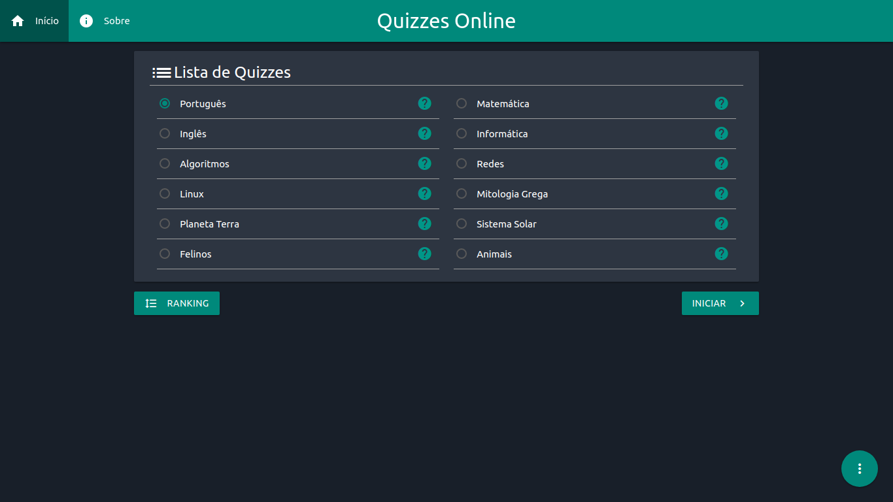
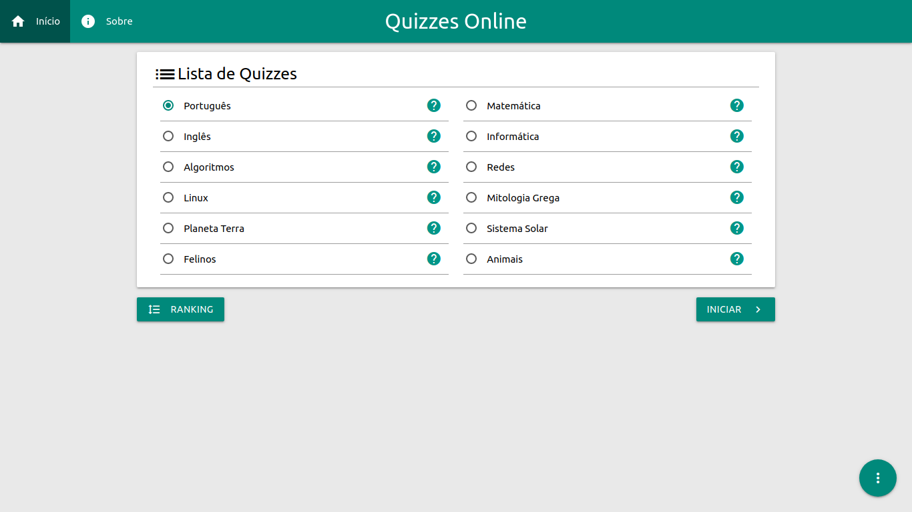

# Quiz Online ISL WYDEN

### Projeto Quizz Bem Estar ISL WYDEN

#### Linguagens e tecnologias usadas:
- HTML
- MaterializeCSS
- JavaScript
- PWA
- Zeit.co (Hospedagem)

#### Algumas características
- Tema Dark/Light
- Adicione quizzes automatizadamente
- Salve seus resultados

### Screenshots

	
  

